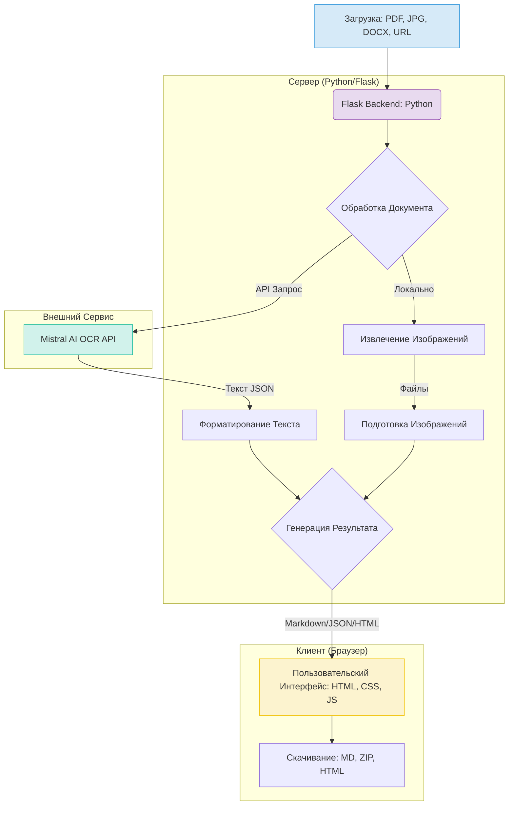

# Mistral OCR App

<p align="center">
  
  
  
  
  
  
  
  
</p>

<p align="center">
  
</p>

**Mistral OCR App** - это современное и мощное веб-приложение, предназначенное для извлечения текста и изображений из различных документов с использованием передового Mistral AI OCR API. Приложение обеспечивает высококачественную конвертацию PDF, изображений (PNG, JPG, JPEG) и документов DOCX в удобные форматы Markdown и JSON. Оно идеально подходит для исследователей, разработчиков, студентов и всех, кому необходима быстрая и точная оцифровка документов.

## ✨ Ключевые Возможности

Mistral OCR App предлагает широкий набор функций, разработанных для максимального удобства и эффективности:

### 📄 Расширенная Поддержка Форматов
-   **PDF Документы:** Полная обработка многостраничных PDF-файлов с извлечением текста и изображений.
-   **Изображения:** Поддержка популярных форматов PNG, JPG, JPEG.
-   **Документы MS Word:** Прямая обработка файлов `.docx`.
-   **URL Загрузка:** Возможность обработки документов по прямой ссылке или из Google Drive.

### 🎨 Современный и Адаптивный Интерфейс
-   **Темы Оформления:** Выбор между темной, светлой и автоматической темой (синхронизация с системными настройками).
-   **Адаптивный Дизайн:** Корректное отображение и функциональность на любых устройствах (от смартфонов 320px до широкоформатных мониторов 1440px+).
-   **Высокий Контраст:** Соответствие стандартам WCAG для обеспечения доступности.
-   **Интуитивный UX:** Плавные анимации, переходы и использование Bootstrap Icons для визуальной ясности.

### ⚙️ Гибкая Система Настроек
-   **Комплексное Управление:** Доступ к 7 категориям настроек: API, Обработка, UI, Визуализация, Экспорт, Производительность, Безопасность.
-   **Профили Настроек:** Готовые профили (`Default`, `Academic`, `Business`, `Performance`) для быстрого старта.
-   **Персонализация:** Возможность экспорта и импорта пользовательских настроек в формате JSON.
-   **Аудит и Сохранение:** История изменений настроек и их локальное сохранение в браузере для удобства пользователя.

### 🔧 Продвинутая Функциональность
-   **Извлечение Изображений:** Автоматическое нахождение и извлечение изображений из документов.
-   **Markdown Рендеринг:** Встроенный просмотр Markdown с подсветкой синтаксиса для удобной работы с результатами.
-   **Оптимизация Производительности:** "Ленивая" загрузка (Lazy Loading) изображений и анимированный прогресс-бар.
-   **Надежность:** Валидация форм в реальном времени и демо-режим для тестирования без API ключа.
-   **Уведомления:** Информативные Toast-уведомления о статусе операций.

### 📤 Гибкие Опции Экспорта
-   **Встроенные Изображения:** Получение единого `.md` файла с изображениями, встроенными как Base64.
-   **Архив с Файлами (.zip):** Экспорт структурированного архива, содержащего `.md` файл, папку с изображениями (`images/figure_X.png`) и файл метаданных (`metadata.json`).
-   **Интерактивный HTML:** Создание HTML-страницы с результатами OCR и интерактивными элементами.
-   **Автоматическая Очистка:** Временные файлы удаляются после обработки для экономии места.

## 📸 Демонстрация Работы

> **Примечание:** Рекомендуется добавить сюда скриншоты интерфейса приложения для наглядной демонстрации его возможностей.
>
> *   **Пример 1:** Скриншот главного экрана с опциями загрузки и настройками.
> *   **Пример 2:** Скриншот экрана результатов с отображением Markdown и извлеченных изображений.
> *   **Пример 3:** Скриншот вкладки "Настройки" с различными категориями.
>
> Также, короткая GIF-анимация или видео, демонстрирующее процесс от загрузки документа до получения результата, значительно улучшит восприятие.

**Пример Workflow (Экспорт в ZIP-архив):**
1.  Пользователь загружает PDF-документ.
2.  Выбирает формат экспорта: "📁 Архив с файлами".
3.  Нажимает "Обработать документ".
4.  Получает `structure_analysis.zip` следующей структуры:
    ```
    structure_analysis.zip/
    ├── document.md           # Чистый markdown текст
    ├── images/
    │   ├── figure_1.png      # Извлеченное изображение 1
    │   └── figure_2.png      # Извлеченное изображение 2
    └── metadata.json         # Информация об OCR (дата, кол-во страниц и т.д.)
    ```
5.  Временные файлы на сервере автоматически удаляются.

## 🛠️ Технологический Стек

Приложение построено на современном и надежном стеке технологий:



### Backend
-   **Python 3.8+:** Основной язык программирования.
-   **Flask:** Легковесный и гибкий веб-фреймворк.
-   **SQLite:** Реляционная база данных для хранения настроек и профилей.
-   **Mistral AI API:** Для выполнения OCR задач.
-   **PyMuPDF (fitz), python-docx, Pillow:** Библиотеки для обработки PDF, DOCX и изображений.

### Frontend
-   **HTML5:** Семантическая разметка для структуры контента.
-   **CSS3:** Модульная архитектура стилей (Base, Components, Layout) с использованием CSS переменных для тем.
-   **JavaScript (ES6+):** Для интерактивности, валидации форм, управления темами и асинхронных запросов.
-   **Bootstrap 5.3:** UI компоненты и сетка для адаптивного дизайна.
-   **Bootstrap Icons:** Набор качественных иконок.
-   **Marked.js:** Для рендеринга Markdown в HTML.
-   **Highlight.js:** Для подсветки синтаксиса в блоках кода.

## 🚀 Быстрый Старт

### Требования
-   Python 3.8 или выше.
-   `pip` (менеджер пакетов Python).
-   `git` (для клонирования репозитория).
-   Mistral AI API ключ (опционально, если не использовать демо-режим).

### Установка
1.  **Клонирование репозитория:**
    ```bash
    git clone https://github.com/ivan-meer/mistral-ocr-app.git
    cd mistral-ocr-app
    ```

2.  **Создание и активация виртуального окружения:**
    ```bash
    python -m venv venv
    ```
    *   Windows:
        ```bash
        venv\Scripts\activate
        ```
    *   macOS/Linux:
        ```bash
        source venv/bin/activate
        ```

3.  **Установка зависимостей:**
    ```bash
    pip install -r requirements.txt
    ```

4.  **Настройка переменных окружения:**
    Скопируйте файл `.env.example` в `.env`:
    ```bash
    cp .env.example .env
    ```
    Затем отредактируйте файл `.env`, указав ваш `MISTRAL_API_KEY` и другие необходимые параметры:
    ```env
    MISTRAL_API_KEY="ВАШ_API_КЛЮЧ_MISTRAL"
    # Другие настройки...
    ```
    > **Примечание:** Если `MISTRAL_API_KEY` не указан, приложение может работать в демо-режиме с ограниченной функциональностью.

5.  **Инициализация базы данных (если требуется):**
    При первом запуске база данных `settings.db` создается автоматически. Если необходимо пересоздать ее или выполнить скрипты из `github_setup.sh` / `github_setup.bat`, следуйте инструкциям в этих файлах. Обычно, для базового запуска это не требуется.

6.  **Запуск приложения:**
    ```bash
    python app.py
    ```
    Откройте [http://localhost:5000](http://localhost:5000) в вашем браузере.

## 📖 Использование

1.  **Загрузка Документа:**
    *   Перейдите на вкладку **"Файл"** для загрузки документа с вашего компьютера.
    *   Или используйте вкладку **"URL"** для указания прямой ссылки на документ или ссылку Google Drive.

2.  **Настройки Обработки:**
    *   Перед обработкой вы можете настроить различные параметры на вкладке **"Настройки"**. Изменения сохраняются автоматически.
    *   Выберите желаемый **"Формат результата"** (Встроенные изображения, Архив .zip, Интерактивный HTML).
    *   Укажите, нужно ли **"Извлекать изображения"**.

3.  **Запуск Обработки:**
    *   Нажмите кнопку **"Обработать документ"**. Дождитесь завершения процесса (прогресс-бар покажет статус).

4.  **Работа с Результатами:**
    *   Результаты OCR будут отображены на странице. Текст в формате Markdown будет отрендерен для предпросмотра.
    *   Извлеченные изображения будут показаны в виде галереи (если опция была включена).
    *   Используйте кнопки **"Скачать"** для сохранения результатов в выбранном ранее формате.
    *   Для PDF-документов доступен режим сравнения (если применимо).

## ⚙️ Настройки Приложения

Вкладка **"Настройки"** предоставляет доступ к детальному конфигурированию приложения:

*   **API и Обработка:** Управление API ключами, лимитами размеров файлов, включение/выключение демо-режима.
*   **Интерфейс и Отображение:** Выбор темы (Светлая, Темная, Авто), настройка шрифтов, включение/выключение анимаций.
*   **Экспорт и Сохранение:** Настройки форматов экспорта по умолчанию, качество изображений, управление метаданными.

Вы можете **Сохранять** изменения, **Сбрасывать** их к значениям по умолчанию, а также **Экспортировать** текущие настройки в JSON-файл или **Импортировать** их из ранее сохраненного файла.

## 📂 Структура Проекта

Основные компоненты проекта организованы следующим образом:

```
mistral-ocr-app/
├── app.py                     # Главный файл Flask приложения (логика, роуты)
├── main.py                    # Может содержать основную логику или быть точкой входа (уточнить назначение)
├── database/
│   ├── init_db.py             # Скрипт для инициализации БД
│   └── settings_manager.py    # Класс для управления настройками в БД
├── static/                    # Статические файлы (CSS, JS, изображения для UI)
│   ├── css/                   # Стили CSS (модульная структура)
│   ├── js/                    # Клиентские скрипты JavaScript
│   └── assets/                # Логотипы, иконки и т.д.
├── templates/                 # HTML шаблоны Jinja2
│   ├── index.html             # Главная страница
│   ├── result.html            # Страница результатов
│   └── compare.html           # Страница сравнения (если используется)
├── assets/                    # Ресурсы для README и проекта (баннеры, примеры)
│   └── img/
├── .env.example               # Пример файла переменных окружения
├── requirements.txt           # Список зависимостей Python
├── settings.db                # Файл базы данных SQLite (создается автоматически)
├── README.md                  # Этот файл
└── ...                        # Другие файлы конфигурации и скрипты
```

## 🗺️ Дорожная Карта (Roadmap)

Мы постоянно работаем над улучшением Mistral OCR App. Вот некоторые из планируемых направлений развития:

### Краткосрочные Цели (1-3 месяца)
-   [ ] **Lightbox для изображений:** Улучшенный просмотр извлеченных изображений.
-   [ ] **Кэширование результатов:** Для ускорения повторной обработки идентичных файлов.
-   [ ] **Улучшение предпросмотра Markdown:** Возможно, с редактированием в реальном времени.

### Среднесрочные Цели (3-6 месяцев)
-   [ ] **Пакетная обработка:** Загрузка и обработка нескольких файлов одновременно.
-   [ ] **Поддержка дополнительных OCR-провайдеров:** Например, Google Cloud Vision или Tesseract OCR (для локальной обработки).
-   [ ] **Расширенная документация API:** Для интеграции с другими системами.

### Долгосрочные Цели (6-12+ месяцев)
-   [ ] **Семантический анализ текста:** Извлечение ключевых слов, сущностей, автоматическое резюмирование.
-   [ ] **Интеграция с AI:** Ответы на вопросы по содержанию документа.
-   [ ] **Полноценная система автоматизации (workflows):** Настраиваемые цепочки обработки.
-   [ ] **Мобильное приложение:** Для удобного использования на смартфонах.

Полный список идей и планов можно найти в файле [FUTURE_DEVELOPMENT.md](FUTURE_DEVELOPMENT.md).

## 🤝 Вклад в Проект

Мы приветствуем любой вклад в развитие Mistral OCR App! Если у вас есть идеи, предложения по улучшению или вы хотите исправить ошибку:

1.  **Ознакомьтесь с [FUTURE_DEVELOPMENT.md](FUTURE_DEVELOPMENT.md)**, чтобы увидеть текущие планы.
2.  **Проверьте существующие [Issues](https://github.com/ivan-meer/mistral-ocr-app/issues)**, чтобы убедиться, что ваше предложение еще не обсуждается.
3.  **Создайте новый Issue** для описания вашей идеи или проблемы.
4.  Если вы хотите внести код, пожалуйста, следуйте стандартной процедуре:
    *   Форкните репозиторий.
    *   Создайте новую ветку для ваших изменений (`git checkout -b feature/ваша-фича`).
    *   Сделайте коммиты с описанием изменений.
    *   Отправьте Pull Request в основную ветку.

Пожалуйста, ознакомьтесь с нашим (пока еще не созданным, но планируемым) файлом `CONTRIBUTING.md` для получения более подробных инструкций по стилю кода и процессу разработки. *Рекомендуется создать этот файл.*

## ❓ Известные Проблемы / Ограничения
*   На данный момент специфические известные проблемы не документированы. Если вы столкнетесь с проблемами, пожалуйста, создайте Issue.
*   Производительность может зависеть от размера и сложности обрабатываемых документов, а также от скорости ответа Mistral AI API.

## 📧 Контакты и Поддержка
*   Для сообщений об ошибках, запросов на новые функции или предложений по улучшению, пожалуйста, используйте **[раздел Issues](https://github.com/ivan-meer/mistral-ocr-app/issues)** нашего GitHub репозитория.
*   Для других вопросов вы можете связаться с автором (если контактная информация будет предоставлена).

## 📄 Лицензия

Проект Mistral OCR App распространяется под лицензией MIT. Подробности смотрите в файле [LICENSE](LICENSE).

---
<p align="center">
  Сделано с ❤️ для эффективной работы с документами.
</p>
<p align="center">
  
</p>
