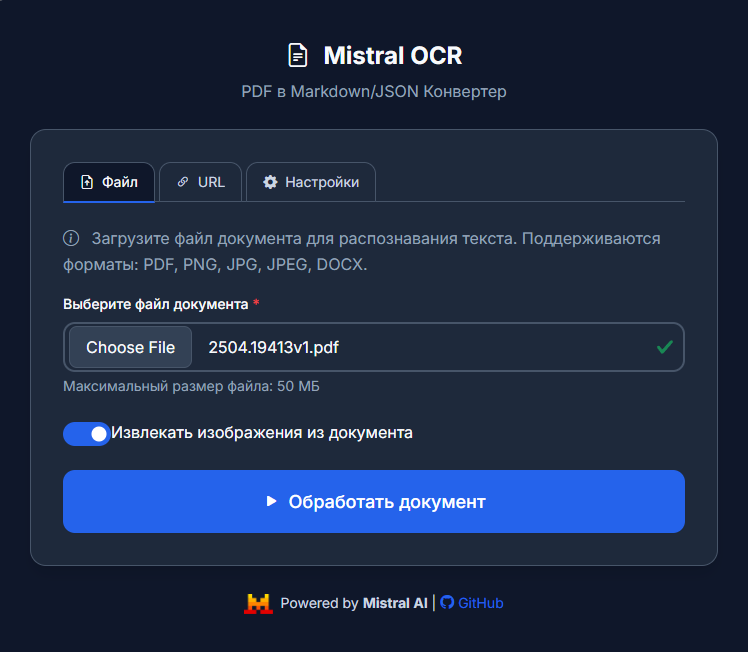

# Mistral OCR App

Современное веб-приложение для извлечения текста и изображений из документов с использованием Mistral AI OCR API. Приложение поддерживает конвертацию PDF, изображений и других документов в форматы Markdown и JSON.


## 🚀 Основные возможности

### 📄 Поддержка форматов
- **PDF документы** - полная поддержка многостраничных PDF
- **Изображения** - PNG, JPG, JPEG
- **Документы** - DOCX (Microsoft Word)
- **URL загрузка** - прямые ссылки и Google Drive

### 🎨 Современный интерфейс
- **Темная/светлая тема** с автоматическим переключением
- **Адаптивный дизайн** для всех устройств (320px-1440px+)
- **Высокий контраст** и соответствие стандартам WCAG
- **Анимации и переходы** для улучшенного UX
- **Bootstrap Icons** для визуальной привлекательности

### ⚙️ Гибкая система настроек
- **7 категорий настроек**: API, Обработка, UI, Визуализация, Экспорт, Производительность, Безопасность
- **Профили настроек**: Default, Academic, Business, Performance
- **Экспорт/импорт** настроек в JSON
- **История изменений** с полным аудитом
- **Локальное сохранение** настроек в браузере

### 🔧 Расширенная функциональность
- **Извлечение изображений** из документов
- **Markdown рендеринг** с подсветкой синтаксиса
- **Lazy loading** изображений для производительности
- **Прогресс-бар** с анимацией загрузки
- **Валидация форм** в реальном времени
- **Демо-режим** для тестирования без API ключа

## 🛠️ Технологический стек

### Backend
- **Python 3.8+** - основной язык программирования
- **Flask** - веб-фреймворк
- **SQLite** - база данных для настроек
- **Mistral AI API** - OCR обработка

### Frontend
- **HTML5** с семантической разметкой
- **CSS3** с модульной архитектурой
- **JavaScript ES6+** с современными возможностями
- **Bootstrap 5.3** - UI компоненты
- **Bootstrap Icons** - иконки
- **Marked.js** - рендеринг Markdown
- **Highlight.js** - подсветка синтаксиса

### Архитектура
```
mistral-ocr-app/
├── app.py                    # Главное Flask приложение
├── database/                 # Система управления настройками
│   ├── init_db.py           # Инициализация базы данных
│   └── settings_manager.py  # Менеджер настроек
├── static/                   # Статические файлы
│   ├── assets/              # Изображения и ресурсы
│   └── css/                 # Модульные стили
│       ├── base/            # Базовые переменные
│       ├── components/      # Компоненты UI
│       ├── layout/          # Макеты и типографика
│       └── main.css         # Главный файл стилей
├── templates/               # HTML шаблоны
│   └── index.html          # Главная страница
├── uploads/                 # Загруженные файлы
├── outputs/                 # Результаты обработки
└── settings.db             # База данных настроек
```

## 📦 Установка и запуск

### Требования
- Python 3.8 или выше
- pip (менеджер пакетов Python)
- Mistral AI API ключ (опционально, есть демо-режим)

### Быстрый старт

1. **Клонирование репозитория**
```bash
git clone https://github.com/ivan-meer/mistral-ocr-app.git
cd mistral-ocr-app
```

2. **Создание виртуального окружения**
```bash
python -m venv venv

# Windows
venv\Scripts\activate

# macOS/Linux
source venv/bin/activate
```

3. **Установка зависимостей**
```bash
pip install -r requirements.txt
```

4. **Настройка переменных окружения**
```bash
# Создайте файл .env
cp .env.example .env

# Отредактируйте .env файл
MISTRAL_API_KEY=your_api_key_here  # Опционально
FLASK_ENV=development
FLASK_DEBUG=True
```

5. **Инициализация базы данных**
```bash
python database/init_db.py
```

6. **Запуск приложения**
```bash
python app.py
```

7. **Открытие в браузере**
```
http://localhost:5000
```

## 🎯 Использование

### Загрузка файлов
1. Выберите вкладку **"Файл"** или **"URL"**
2. Загрузите документ или введите ссылку
3. Настройте опции извлечения изображений
4. Нажмите **"Обработать документ"**

### Настройка приложения
1. Перейдите на вкладку **"Настройки"**
2. Настройте параметры в категориях:
   - **API и Обработка** - ключи API, размеры файлов
   - **Интерфейс и Отображение** - тема, шрифты, анимации
   - **Экспорт и Сохранение** - форматы, качество изображений
3. Сохраните настройки или экспортируйте их

### Работа с результатами
- Просматривайте результаты с подсветкой синтаксиса
- Скачивайте в форматах Markdown или JSON
- Увеличивайте изображения кликом
- Копируйте текст из результатов

## ⚙️ Конфигурация

### Настройки API
```python
# В .env файле
MISTRAL_API_KEY=your_mistral_api_key
API_TIMEOUT=30
MAX_RETRIES=3
USE_MOCK_OCR=True  # Для демо-режима
```

### Настройки приложения
```python
# В app.py
MAX_FILE_SIZE = 50 * 1024 * 1024  # 50 МБ
ALLOWED_EXTENSIONS = {'pdf', 'png', 'jpg', 'jpeg', 'docx'}
UPLOAD_FOLDER = 'uploads'
OUTPUT_FOLDER = 'outputs'
```

### Настройки базы данных
Все пользовательские настройки сохраняются в SQLite базе данных `settings.db` с поддержкой:
- Категоризации настроек
- Профилей настроек
- Истории изменений
- Экспорта/импорта

## 🎨 Темы и стили

### Поддерживаемые темы
- **Темная тема** (по умолчанию) - оптимизирована для работы в условиях низкой освещенности
- **Светлая тема** - классический светлый интерфейс
- **Автоматическая** - следует системным настройкам

### Цветовая палитра
```css
/* Темная тема */
--bg-primary: #0f172a;      /* Основной фон */
--bg-secondary: #1e293b;    /* Фон карточек */
--bg-tertiary: #334155;     /* Фон элементов */
--text-primary: #f8fafc;    /* Основной текст */
--text-secondary: #cbd5e1;  /* Вторичный текст */
--primary-blue: #2563eb;    /* Акцентный цвет */
```

### Адаптивность
- **Mobile First** подход
- Breakpoints: 320px, 576px, 768px, 992px, 1200px, 1440px
- Touch-friendly элементы (минимум 44px)
- Оптимизированная типографика для всех экранов

## 🔒 Безопасность

### Валидация файлов
- Проверка типов файлов по расширению и MIME-типу
- Ограничение размера файлов (50 МБ по умолчанию)
- Санитизация имен файлов
- Автоматическая очистка временных файлов

### Защита данных
- Локальное хранение настроек в браузере
- Опциональное логирование с анонимизацией
- Защита от XSS и инъекций
- Безопасная обработка пользовательского ввода

## 📊 Производительность

### Оптимизации
- **Lazy loading** изображений
- **Модульная загрузка** CSS
- **Минимизированные анимации** на слабых устройствах
- **Эффективное использование памяти**
- **Кэширование результатов** (опционально)

### Метрики
- Время загрузки страницы: < 2 секунд
- First Contentful Paint: < 1.5 секунд
- Lighthouse Score: 90+ (Performance, Accessibility, Best Practices)

## 📸 Скриншот интерфейса



*Современный интерфейс с табом настроек и темной темой*

Интерфейс демонстрирует:
- **Современный дизайн** с темной темой
- **Таб настроек** с аккордеоном
- **Секция "API и Обработка"** с полями для настройки
- **Переключатели** для демо-режима и автоочистки
- **Чистый минималистичный стиль** без лишних фонов

## 🧪 Тестирование

### Демо-режим
Приложение включает демо-режим для тестирования без API ключа:
- Имитация OCR обработки
- Генерация тестовых результатов
- Полная функциональность интерфейса

### Тестовые файлы
Используйте тестовые документы из папки `test_files/` для проверки функциональности.

## 🤝 Вклад в проект

### Как внести вклад
1. Fork репозитория
2. Создайте feature branch (`git checkout -b feature/amazing-feature`)
3. Commit изменения (`git commit -m 'Add amazing feature'`)
4. Push в branch (`git push origin feature/amazing-feature`)
5. Откройте Pull Request

### Стандарты кода
- Следуйте PEP 8 для Python кода
- Используйте семантические commit сообщения
- Добавляйте комментарии для сложной логики
- Тестируйте изменения перед отправкой

## 📝 Лицензия

Этот проект распространяется под лицензией MIT. См. файл [LICENSE](LICENSE) для подробностей.

## 🆘 Поддержка

### Получение помощи
- 📧 Email: info@how2ai.online
- 🐛 Issues: [GitHub Issues](https://github.com/ivan-meer/mistral-ocr-app/issues)
- 📖 Документация: [Wiki](https://github.com/ivan-meer/mistral-ocr-app/wiki)

### FAQ

**Q: Нужен ли API ключ Mistral для работы?**
A: Нет, приложение работает в демо-режиме без API ключа. Для полной функциональности рекомендуется получить ключ на [mistral.ai](https://mistral.ai).

**Q: Какие форматы файлов поддерживаются?**
A: PDF, PNG, JPG, JPEG, DOCX. Максимальный размер файла - 50 МБ.

**Q: Сохраняются ли мои файлы на сервере?**
A: Файлы автоматически удаляются после обработки. Вы можете настроить время хранения в настройках.

**Q: Можно ли использовать приложение офлайн?**
A: Интерфейс работает офлайн, но для OCR обработки требуется подключение к интернету.

## 🔄 Обновления

### Версия 2.0.0 (Текущая)
- ✅ Полностью переработанный интерфейс
- ✅ Система управления настройками
- ✅ Поддержка тем (темная/светлая)
- ✅ Адаптивный дизайн
- ✅ Улучшенная производительность
- ✅ Расширенная валидация

### Планируемые функции
- [ ] Пакетная обработка файлов
- [ ] Интеграция с облачными хранилищами
- [ ] API для разработчиков
- [ ] Мобильное приложение
- [ ] Поддержка дополнительных языков

## 🙏 Благодарности

- [Mistral AI](https://mistral.ai) за предоставление OCR API
- [Bootstrap](https://getbootstrap.com) за UI компоненты
- [Bootstrap Icons](https://icons.getbootstrap.com) за иконки
- [Marked.js](https://marked.js.org) за рендеринг Markdown
- [Highlight.js](https://highlightjs.org) за подсветку синтаксиса

---

<div align="center">
  
  <br>
  <strong>Powered by Mistral AI</strong>
  <br>
  <a href="https://github.com/ivan-meer/mistral-ocr-app">⭐ Star this project</a>
</div>
