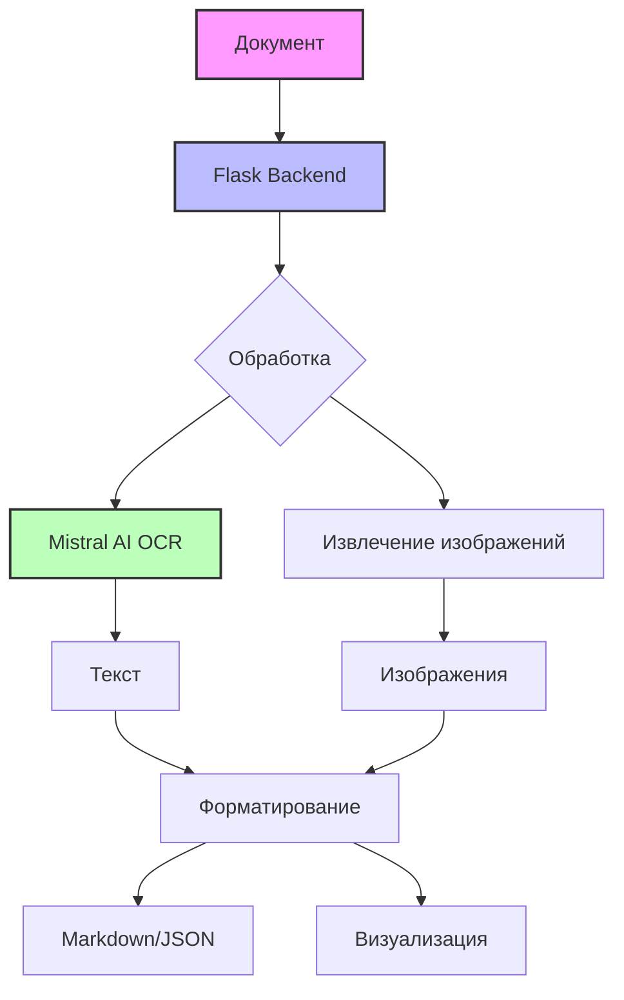

# Mistral OCR App

    

Современное веб-приложение для извлечения текста и изображений из документов с использованием Mistral AI OCR API. Приложение поддерживает конвертацию PDF, изображений и других документов в форматы Markdown и JSON.


## ✨ Основные возможности

### 📄 Поддержка форматов
- **PDF документы** - полная поддержка многостраничных PDF
- **Изображения** - PNG, JPG, JPEG
- **Документы** - DOCX (Microsoft Word)
- **URL загрузка** - прямые ссылки и Google Drive

### 🎨 Современный интерфейс
- **Темная/светлая тема** с автоматическим переключением
- **Адаптивный дизайн** для всех устройств (320px-1440px+)
- **Высокий контраст** и соответствие стандартам WCAG
- **Анимации и переходы** для улучшенного UX
- **Bootstrap Icons** для визуальной привлекательности

### ⚙️ Гибкая система настроек
- **7 категорий настроек**: API, Обработка, UI, Визуализация, Экспорт, Производительность, Безопасность
- **Профили настроек**: Default, Academic, Business, Performance
- **Экспорт/импорт** настроек в JSON
- **История изменений** с полным аудитом
- **Локальное сохранение** настроек в браузере

### 🔧 Расширенная функциональность
- **Извлечение изображений** из документов
- **Markdown рендеринг** с подсветкой синтаксиса
- **Lazy loading** изображений для производительности
- **Прогресс-бар** с анимацией загрузки
- **Валидация форм** в реальном времени
- **Демо-режим** для тестирования без API ключа

## 🛠️ Технологический стек



### Backend
- **Python 3.8+** - основной язык программирования
- **Flask** - веб-фреймворк
- **SQLite** - база данных для настроек
- **Mistral AI API** - OCR обработка

### Frontend
- **HTML5** с семантической разметкой
- **CSS3** с модульной архитектурой
- **JavaScript ES6+** с современными возможностями
- **Bootstrap 5.3** - UI компоненты
- **Bootstrap Icons** - иконки
- **Marked.js** - рендеринг Markdown
- **Highlight.js** - подсветка синтаксиса

## 🚀 Быстрый старт

### Требования
- Python 3.8 или выше
- pip (менеджер пакетов Python)
- Mistral AI API ключ (опционально, есть демо-режим)

### Установка

1. **Клонирование репозитория**
```bash
git clone https://github.com/ivan-meer/mistral-ocr-app.git
cd mistral-ocr-app
```

2. **Создание виртуального окружения**
```bash
python -m venv venv

# Windows
venv\Scripts\activate

# macOS/Linux
source venv/bin/activate
```

3. **Установка зависимостей**
```bash
pip install -r requirements.txt
```

4. **Настройка окружения**
```bash
cp .env.example .env
# Отредактируйте .env файл с вашими настройками
```

5. **Запуск приложения**
```bash
python app.py
# Откройте http://localhost:5000 в браузере
```

## 📖 Использование

### Загрузка документов
1. Выберите вкладку "Файл" или "URL"
2. Загрузите документ или введите ссылку
3. Настройте параметры обработки
4. Нажмите "Обработать документ"

### Работа с результатами
- Просмотр результатов с подсветкой синтаксиса
- Скачивание в форматах Markdown/JSON
- Просмотр и сохранение изображений
- Режим сравнения для PDF документов

## 🤝 Вклад в проект

Мы приветствуем ваш вклад в развитие проекта! Пожалуйста, ознакомьтесь с нашим [руководством по внесению изменений](CONTRIBUTING.md).

## 📄 Лицензия

Проект распространяется под лицензией MIT. Подробности в файле [LICENSE](LICENSE).
